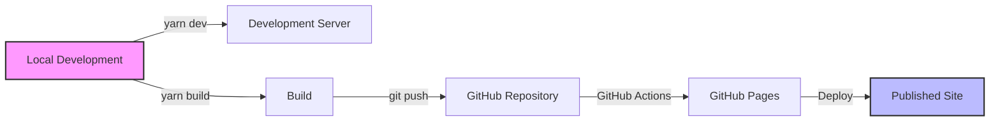

# ✨ Personal Portfolio ✨

[https://portfolio.rainyflow.net](http://portfolio.rainyflow.net)

---

  
  
  
  
  

---

## 🚀 Development Flow

```mermaid
graph LR
    A[Local Development] -->|yarn dev| B[Development Server]
    A -->|yarn build| C[Build]
    C -->|git push| D[GitHub Repository]
    D -->|GitHub Actions| E[GitHub Pages]
    E -->|Deploy| F[Published Site]
    
    style A fill:#f9f,stroke:#333,stroke-width:2px
    style F fill:#bbf,stroke:#333,stroke-width:2px
```